# SCTV - Security Camera Television System

A comprehensive security camera monitoring system with real-time streaming, AI-powered person detection, and cross-platform notifications.

## Features

- **Live Video Streaming** - Real-time camera feeds with WebRTC support
- **AI Person Detection** - Continuous background monitoring using YOLOv8
- **Push Notifications** - Firebase Cloud Messaging for mobile alerts
- **Multi-Platform** - Web dashboard and mobile app
- **Camera Management** - Add, configure, and monitor multiple cameras

## Requirements

- .NET 6.0 SDK
- Node.js 16+
- Python 3.8+
- Docker & Docker Compose
- PostgreSQL
- FFmpeg
- Android Studio (for mobile development)

## Installation

See detailed installation guide: [docs/installations](docs/installations)

### Quick Start

1. **Setup Database**
   ```bash
   # Create PostgreSQL database named 'SCTV'
   ```

2. **Backend Services**
   ```bash
   cd backend
   # Start Kafka infrastructure
   cd infrastructures/Kafka && docker-compose up -d
   # Start services
   dotnet run --project monitors/SCTV.AppHost
   ```

3. **AI Detection Service**
   ```bash
   cd backend/src/Detections
   pip install -r requirements.txt
   python src/main.py
   ```

4. **Frontend Dashboard**
   ```bash
   cd frontend && npm install && npm start
   ```

5. **Mobile App**
   ```bash
   cd mobile && npm install && npm run android
   ```

## System Workflows

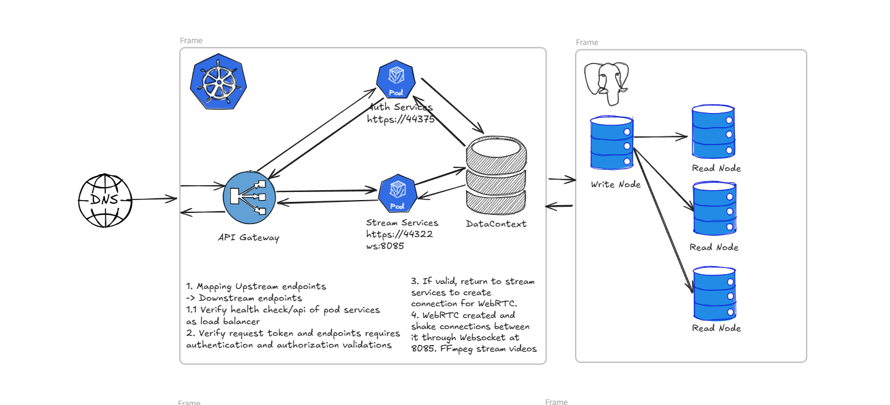
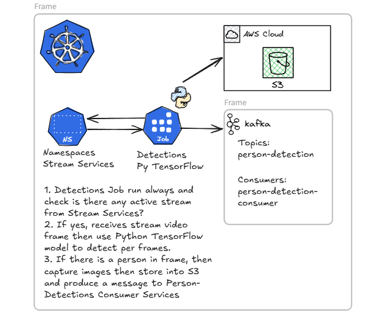
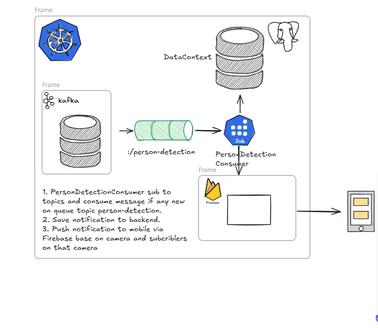
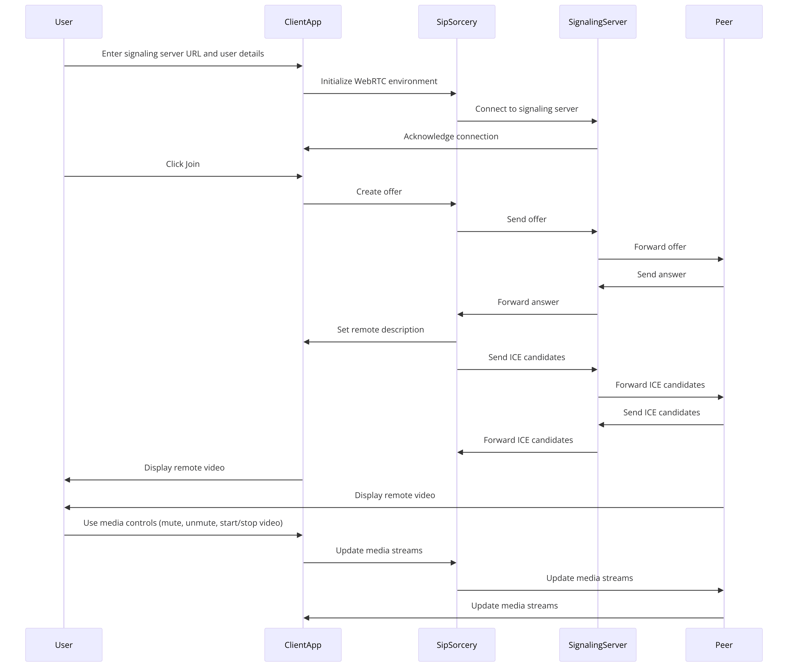

## Installation Screenshots

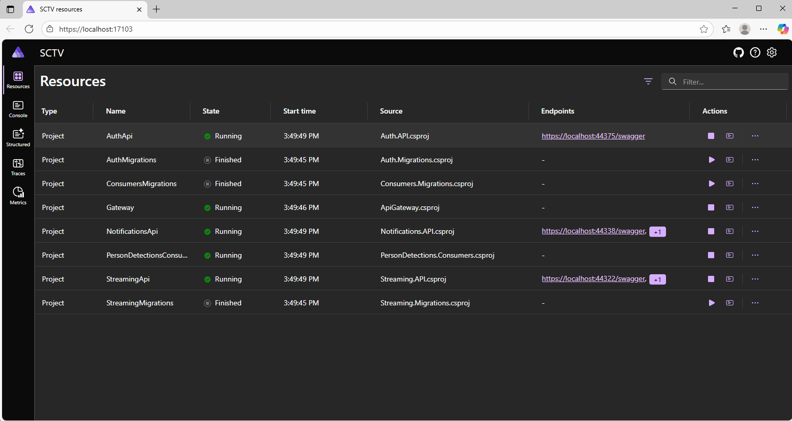
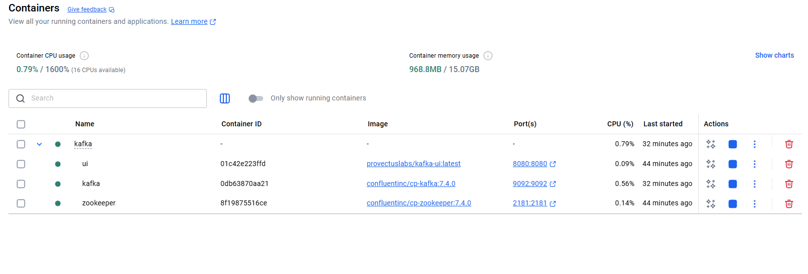

## Demos

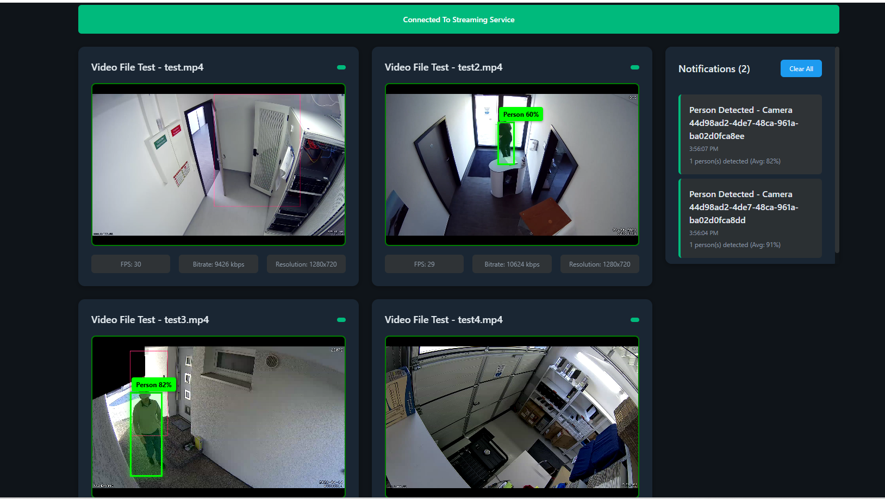
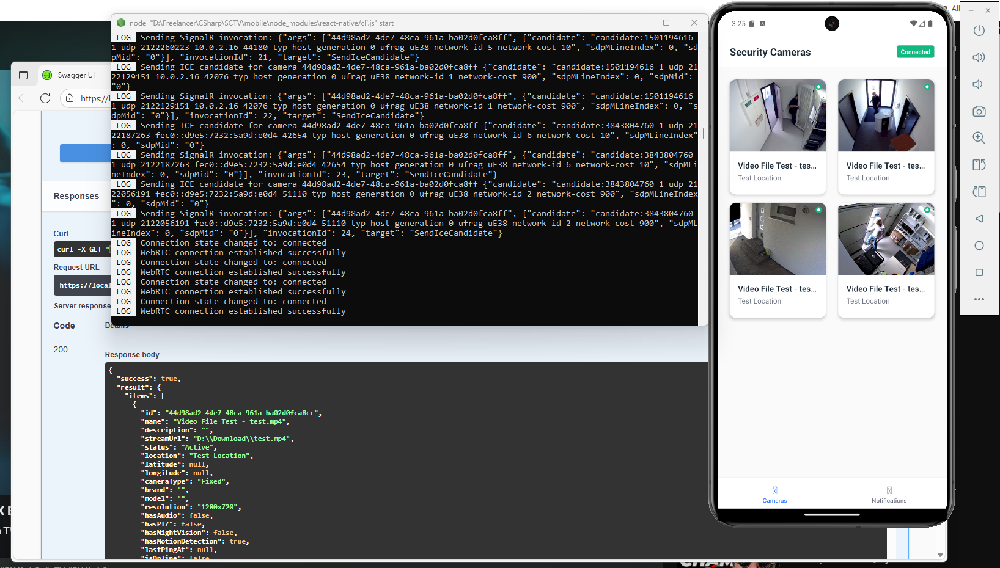
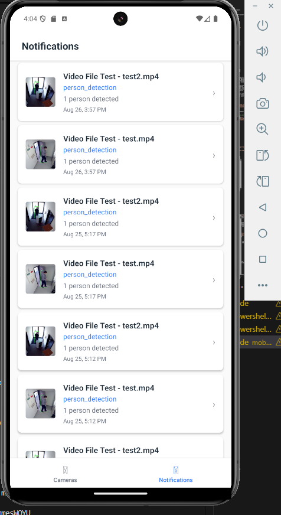
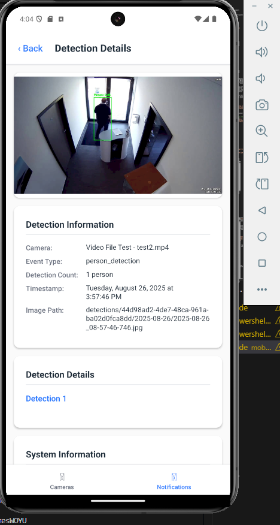
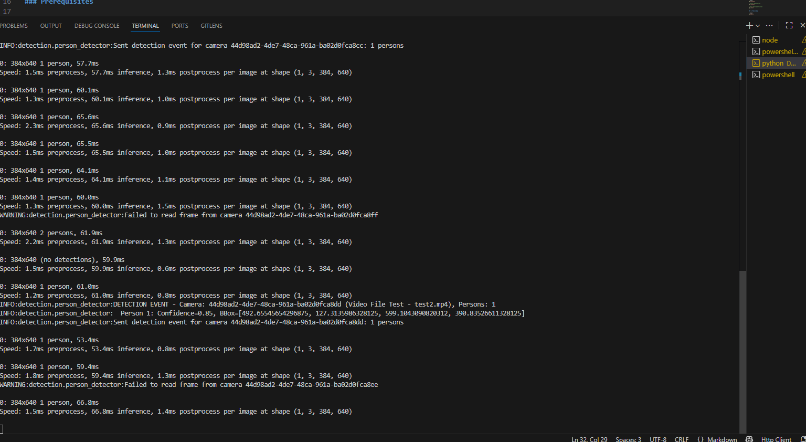
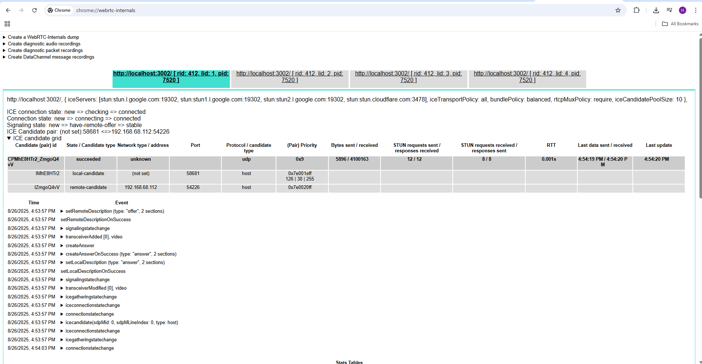

### Video Demo

Frontend demo
https://www.loom.com/share/55b286a2d9a04aba99a59480e13a413a?sid=b39e3047-05e6-4413-bc8e-f4fa4235f8e2

Mobile demo
https://www.loom.com/share/d9755c779dc2464aa3c4873a749a00f2?sid=c0316848-adf3-4759-93bd-fd28af8fdfc8

## Architecture

- **Backend** (.NET Core) - Microservices with API Gateway, Authentication, Streaming, Consumer services
- **Frontend** (React) - Web dashboard for camera monitoring
- **Mobile** (React Native) - Mobile app for notifications
- **AI Detection** (Python) - YOLOv8-powered person detection